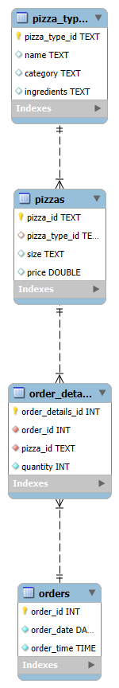

#  Pizza Sales SQL Data Analysis Project

##  Project Overview

This project analyzes a **pizza restaurant sales dataset using SQL** to uncover business insights such as customer preferences, revenue trends, popular pizza categories, and ordering patterns.

The analysis is performed using **multi-table SQL queries**, combining information from multiple related tables to answer real-world business questions. The goal of this project is to demonstrate **data analysis skills using SQL**, including joins, aggregations, grouping, and analytical queries.

---

#  Objectives

The main objectives of this project are to:

* Analyze overall pizza sales performance
* Identify the most popular pizzas and categories
* Understand customer ordering patterns
* Determine peak order times
* Calculate revenue and sales distribution
* Extract business insights that can help improve sales strategies

---

## Database ER Diagram



---

#  Dataset Description

The dataset consists of **four relational tables** representing a pizza store database.

### 1️ Orders

Contains general order information.

| Column   | Description                    |
| -------- | ------------------------------ |
| order_id | Unique ID for each order       |
| date     | Date when the order was placed |
| time     | Time when the order was placed |

---

### 2️ Order Details

Contains information about individual items in each order.

| Column           | Description                |
| ---------------- | -------------------------- |
| order_details_id | Unique ID for order detail |
| order_id         | Reference to order         |
| pizza_id         | Pizza ordered              |
| quantity         | Number of pizzas ordered   |

---

### 3️ Pizzas

Contains information about pizzas including size and price.

| Column        | Description              |
| ------------- | ------------------------ |
| pizza_id      | Unique pizza identifier  |
| pizza_type_id | Type of pizza            |
| size          | Pizza size (S, M, L, XL) |
| price         | Price of the pizza       |

---

### 4️ Pizza Types

Contains detailed information about pizza types.

| Column        | Description                                  |
| ------------- | -------------------------------------------- |
| pizza_type_id | Unique pizza type ID                         |
| name          | Pizza name                                   |
| category      | Category (Classic, Veggie, Chicken, Supreme) |
| ingredients   | Ingredients used                             |

---

#  Tools & Technologies

* **SQL (MySQL/PostgreSQL compatible queries)**
* Relational Database Concepts
* Data Aggregation & Analysis
* GitHub for version control

---

#  Key Analysis Performed

## Basic Analysis

* Total number of orders placed
* Total revenue generated
* Highest priced pizza
* Most common pizza size ordered
* Top 5 most ordered pizzas

## Intermediate Analysis

* Total quantity of pizzas sold by category
* Order distribution by hour of the day
* Category-wise pizza sales analysis
* Average pizzas ordered per day
* Top 3 pizzas based on revenue

## Advanced Analysis

* Percentage contribution of each pizza category to total revenue
* Cumulative revenue over time
* Top selling pizzas within each category
* Revenue analysis by pizza size

---

#  Business Insights

Some insights derived from the analysis include:

* Identification of **best selling pizza categories**
* Understanding **customer pizza size preference**
* Detecting **peak ordering hours**
* Determining **highest revenue generating pizzas**
* Analyzing **daily and category based sales performance**

These insights can help restaurants optimize **menu planning, pricing strategy, and staffing during peak hours**.

---

#  Example SQL Query

Example: Finding the **top selling pizzas by quantity**

```sql
SELECT 
    pt.name,
    SUM(od.quantity) AS total_sold
FROM order_details od
JOIN pizzas p ON od.pizza_id = p.pizza_id
JOIN pizza_types pt ON p.pizza_type_id = pt.pizza_type_id
GROUP BY pt.name
ORDER BY total_sold DESC
LIMIT 5;
```

---

#  Key SQL Concepts Used

* SELECT
* JOIN (INNER JOIN)
* GROUP BY
* ORDER BY
* Aggregate Functions (SUM, COUNT)
* Subqueries
* Date & Time Analysis

---

#  Learning Outcomes

Through this project, I strengthened my understanding of:

* SQL joins for multi-table analysis
* Data aggregation and summarization
* Query optimization
* Business insight generation from raw data

---

